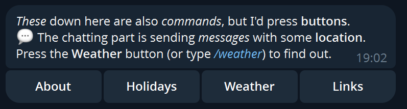
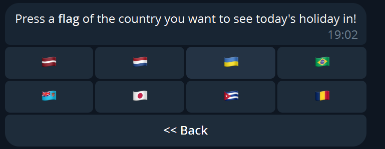
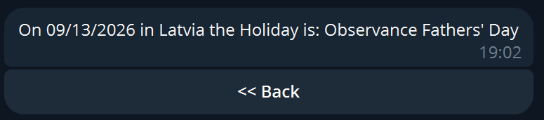
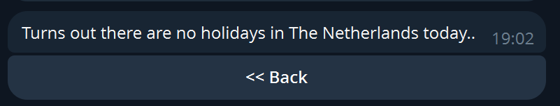
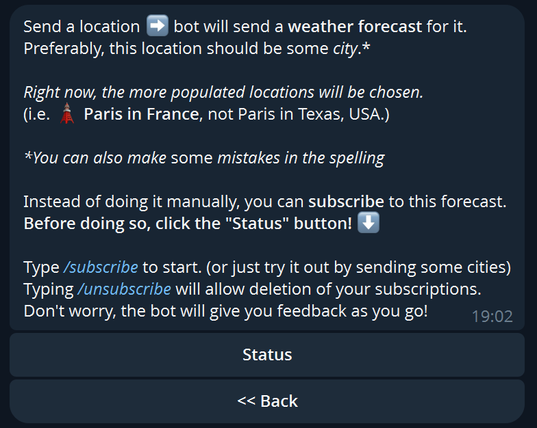
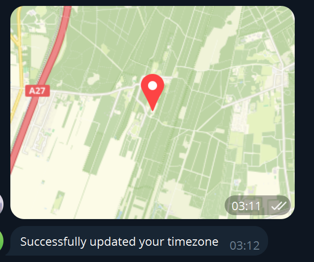
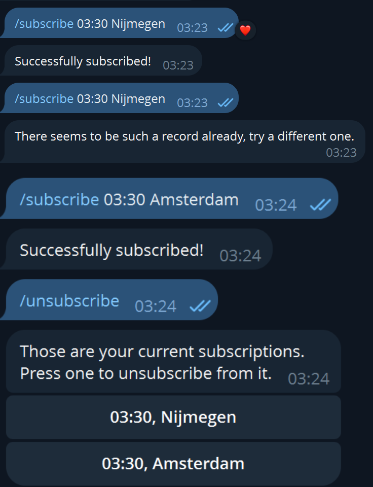
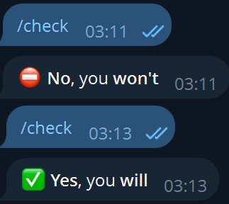

# Multi-functional Telegram Bot

This project contains the Go code of a Telegram bot with multiple features reachable from an interactive menu:
- The owner can write an About Me section.
- The user can discover whether there is an ongoing holiday in 8 different countries.
- The user can send a city of choice and receive the current weather report for it;
  - The user can subscribe to a daily weather forecast for the city of choice, with their timezone taken in account.

## Prerequisites 
- Docker (Desktop): the minimal setup is running the DB deployed
- If you would like to run the app locally, then Go(Lang) must be installed.
- GNU Make for easy boot and teardown

## Control 

### Environment Variables

Located in `configs/.env`. Each variable explained:
- `MODE string`: `server | worker`, **required**. The operation mode of the app, explained [below](#accessing-the-functionalities).
- `DB_PORT string`: the host port on which the database server will be available. Defaults to `27017`.
- `TELEGRAM_BOT_TOKEN string`: the **required** token used to control the Telegram bot. Read the official [tutorial](https://core.telegram.org/bots/tutorial).
- `TGBOT_UPDATE_OFFSET, TGBOT_UPDATE_TIMEOUT int`: optional, default to `0` and `60` respectively. [Read more](https://go-telegram-bot-api.dev/).
- `DB_URI string`: used to establish a connection with the database. Leave it empty when running locally, but change it to `"mongodb://mongodb_deployed:YOUR_PORT"` when running both the app and the db in Docker. `YOUR_PORT` must correspond to the chosen `DB_PORT`, or to `27017` when the default port is used.

#### External APIs

This section covers the environment variables required to utilize the external APIs: [Holidays](https://docs.abstractapi.com/api/holidays) and [OpenWeather](https://openweathermap.org/api).
- `HOLIDAYS_API_URL string`: **required**, can be taken from the example `.env` (_or from Abstract if a newer version is available and is backwards-compatible_).
- `HOLIDAYS_API_KEY string`: **required**, this is the API key obtainable from Abstract at the hyperlink above.
- `OPENWEATHER_GEOCODING string`: **required**, can be taken from the example `.env` (_or from OpenWeather if a newer version is available and is backwards-compatible_).
- `OPENWEATHER_FORECAST string`: **required**, can be taken from the example `.env`.
- `OPENWEATHER_ICONS string`: **required**, can be taken from the example `.env`.
- `OPENWEATHER_API_KEY string`: the **required** universal API token used for every request to any of the above [OpenWeather](https://openweathermap.org/api) endpoints.

### Makefile Commands 
- `make local`: runs db in a docker container and go code locally 
- `make deployed`: runs both db and go code in two docker containers
- `make stop`: stops the container operation
- `make clean`: does what stop does but removes saved container data, too

## Accessing the Functionalities

Once you get the app working, the [`server`](#environment-variables) mode will allow you to chat with the bot on Telegram.  
Begin by typing the `/start` command, and you will be greeted with the following menu:
  
The primary way to interact with the bot is to press buttons in the menu. Still, each button has a command counterpart and the effect will be identical.  

### About & Links Buttons

The bot will send a pre-defined _text_ message, which supports Markdown. Its contents can be customized by changing [this](https://github.com/durned/about-me-bot/blob/dev/about-me-bot/internal/models/models.go#L114) and [this](https://github.com/durned/about-me-bot/blob/dev/about-me-bot/internal/models/models.go#L117) constant respectively.

### Holidays

When pressing the `Holidays` button, the following menu appears:

The user can then press a specific flag to discover whether there is an ongoing holiday in that respective country today:

One can configure the particular country layout [here](https://github.com/durned/about-me-bot/blob/dev/about-me-bot/internal/models/models.go). Consult the Telegram library docs to learn how markups work.  
As long as the data sent when pressing the respective country is a 2-letter long country code, the API calls will not fail.

### Weather

Send the City, and the bot will send the current weather situation in it.  

#### Forecast Subscription

Send a location attachment in Telegram, and the bot will derive and save your timezone:  
  
You may then subscribe to receive a weather forecast at some specific time for the specific city:  
  
You may also check whether all the conditions are met for you to receive the automated forecast:  

## Worker Mode
The app can be launched in `worker` [mode](#environment-variables), which will go through the automated forecast database, set timers, and send the messages at the specified time to the respective users.

## Coverage
The tests achieve upwards of 70% code coverage. There are unit tests, module tests, and intergartion tests. 